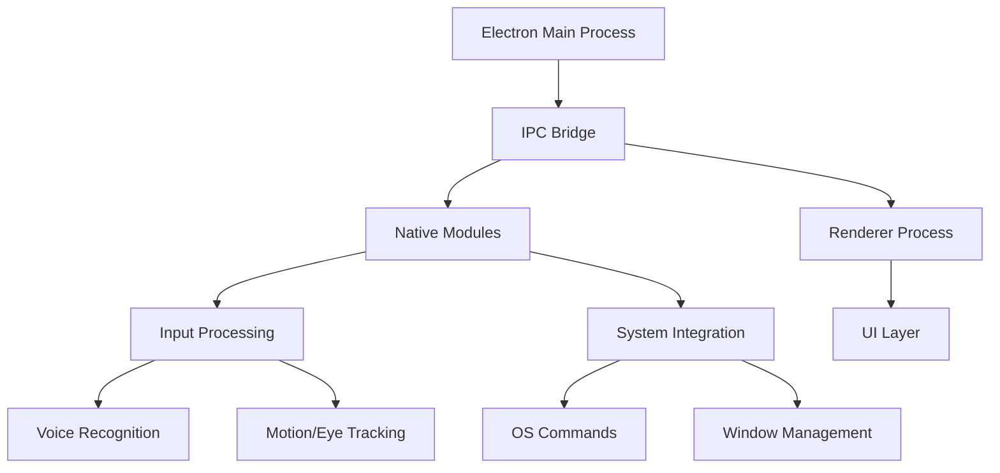

# System Architecture & Design

## Primary Objective
To create a system that enables efficient, precise computer interaction without relying on finger movements, specifically designed for users with RSI.

## Feasibility Analysis

**Achievable with Low Latency:**
- Voice commands (20-200ms latency typical)
- Basic cursor control
- System commands
- Text input
- Window management

**More Challenging for Real-time:**
- Precise cursor control with eye/head tracking (needs optimization)
- Complex gestures
- Gaming or other timing-critical applications

## Proposed Architecture



## Key Architectural Components

1. **Core Application (Electron)**
   - Main process for system-level operations
   - Renderer process for UI
   - IPC (Inter-Process Communication) for fast internal communication
   - Native modules for performance-critical operations

2. **Input Processing Layer**
   - Dedicated thread for input processing
   - Buffer system for smoothing inputs
   - Priority queue for command processing
   - Local voice processing when possible to reduce latency

3. **Performance Optimizations**
   - WebAssembly for compute-intensive operations
   - Native modules for OS-level integration
   - Local processing where possible, cloud for complex operations
   - Efficient state management

## Command System Design

### Voice Commands

1. **Command Types**
   - Direct System Commands ("click", "scroll up", "open browser")
   - Text Input ("type hello", "delete word")
   - Navigation ("go to line 20", "next tab")
   - Custom Macros ("start coding mode", "begin dictation")

2. **Command Structure**
```typescript
interface VoiceCommand {
  trigger: string | RegExp;          // Voice trigger phrase
  aliases?: string[];                // Alternative trigger phrases
  action: CommandAction;             // Function to execute
  context?: CommandContext;          // When/where command is valid
  priority: number;                  // Execution priority
  macroSteps?: CommandAction[];      // For compound commands
}

interface CommandContext {
  application?: string[];           // Specific applications
  mode?: string;                    // Current mode (e.g., "coding", "browsing")
  conditions?: () => boolean;       // Custom conditions
}
```

### Gesture Commands

1. **Gesture Types**
   - Hand Positions (open, closed, pointing)
   - Hand Movements (swipe, circle, push)
   - Multi-hand Gestures (pinch-zoom, rotate)
   - Finger Counting/Positions (without requiring fine motor control)

2. **Gesture Recognition System**
```typescript
interface GestureRecognition {
  captureDevice: Camera | Sensor;
  tracking: {
    handTracking: boolean;
    fingerTracking: boolean;
    depthSensing?: boolean;
  };
  gestureModels: {
    staticPoses: ML.Model;
    dynamicGestures: ML.Model;
  };
  calibration: {
    userDistance: number;
    gestureSpace: BoundingBox;
  };
}
```

3. **Common Gesture Mappings**
   - Hand up/down → Scroll
   - Swipe left/right → Navigate history
   - Push/pull → Zoom
   - Circular motion → Volume/slider control
   - Hand position hold → Right/left click

### Custom Macro System

```typescript
interface CustomMacro {
  name: string;
  triggers: {
    voice?: string[];
    gesture?: GestureType[];
  };
  actions: CommandAction[];
  options: {
    sequential: boolean;    // Execute in sequence or parallel
    cancelable: boolean;    // Can be interrupted
    feedback: FeedbackType; // Visual/audio feedback
  };
}
```

## Implementation Phases

1. **Phase 1: Voice Foundation**
   - Basic voice command recognition
   - Essential system controls
   - Simple text input
   - Command customization UI

2. **Phase 2: Gesture Integration**
   - Camera/sensor integration
   - Basic gesture recognition
   - Gesture command mapping
   - Calibration system

3. **Phase 3: Advanced Features**
   - Custom macro creation
   - Context-aware commands
   - Combined voice/gesture commands
   - User profiles and settings

## Latency Targets

- Voice commands: < 100ms local, < 300ms cloud
- Gesture recognition: < 50ms
- System commands: < 20ms
- Text input: < 50ms
- Combined operations: < 200ms

## Cross-Platform Considerations

- Native accessibility API integration
- Platform-specific optimizations
- Consistent command interface
- Adaptive input processing

## Next Steps

1. Implement basic voice command infrastructure
2. Create command registration system
3. Develop gesture recognition prototype
4. Build custom macro interface
5. Optimize for latency and reliability 